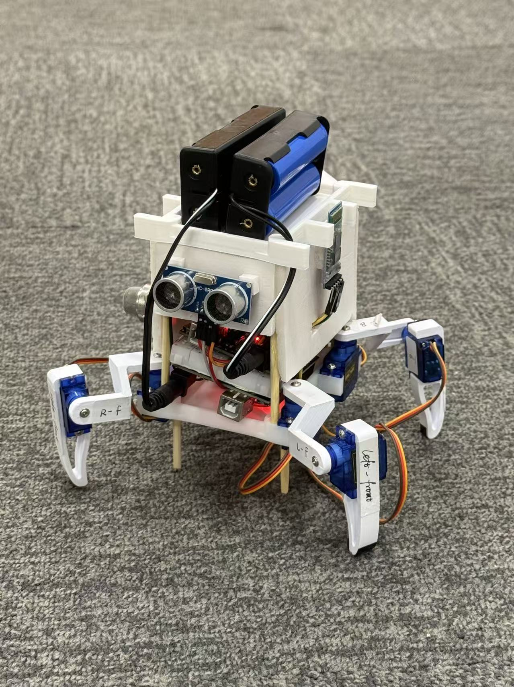

# 🕷️ Spider-Inspired Bionic Robot for Forest Fire Detection

> A spider-inspired bionic quadruped robot integrating smoke, temperature, humidity, and ultrasonic sensors with Bluetooth, controlled by dual Arduino UNO boards, designed for low-cost, mobile early forest fire detection with obstacle avoidance and real-time data transmission.

---

## 🌲 Project Abstract

This project presents a bionic robot prototype inspired by the locomotion of spiders, specifically designed for real-time forest fire detection in unstructured environments. By integrating multi-sensor modules, obstacle-adaptive limb mechanisms, and early-warning logic, the system offers a mobile, scalable, and biologically inspired solution for environmental monitoring. The project addresses both robotic design and environmental sensing challenges, contributing to the development of autonomous forest surveillance technologies.

---

## 🧠 Motivation and Research Problem

Forest fires are increasingly frequent and destructive due to climate change and human activity. Early detection is crucial for mitigating their environmental and economic impacts. However, traditional methods such as satellite imaging or fixed-location sensors often suffer from low resolution, delayed response times, and lack of ground-level detail in dense vegetation.

Inspired by the robust adaptability of spider locomotion, this project proposes a mobile robotic solution capable of traversing uneven terrains and detecting fire-related indicators (e.g., temperature, gas concentration, flame presence). The interdisciplinary system explores the convergence of **biomechanics**, **sensor fusion**, and **autonomous exploration**.

---

## 🎯 Project Objectives

- Design a spider-inspired multi-legged robot capable of navigating forest-like environments.
- Integrate environmental sensing modules (e.g., flame, gas, temperature sensors).
- Implement fire detection and warning logic with real-time feedback.
- Evaluate mobility performance and detection accuracy in simulated field conditions.

---

## 🧩 System Architecture

The system consists of three main components:

### 🔧 Mechanical Design
- 6-legged spider-like structure (hexapod)
- Jointed legs for obstacle climbing and terrain adaptation
- Lightweight frame for mobility and modular extension

### 🔌 Electronic & Sensing Subsystems
- Microcontroller (Arduino Uno)
- Sensors:
  - MQ-2 (smoke/gas)
  - Flame IR sensor
  - DHT11 (temperature & humidity)
- Wireless transmission via Bluetooth module

## 🔬 Methodology

1. **Biological Analysis**: Study of spider locomotion mechanisms to inform robotic kinematics.
2. **Mechanical CAD Modeling**: Design and 3D print chassis and limbs.
3. **Electronic Integration**: Assemble sensing circuit, configure microcontroller I/O.
4. **Control & Sensing Code**: Arduino-based fire detection logic using analog sensor data.
5. **Validation**: Run tests in forest-like conditions and benchmark detection sensitivity.

---

## 🖼️ Prototype

  
  
Figure: Spider-inspired robot prototype with onboard fire sensors

## 🔌 Circuit Diagram

  
  
<em>Figure: Circuit diagram showing connection of flame, gas (MQ-2), and temperature sensors to Arduino.</em>

---

